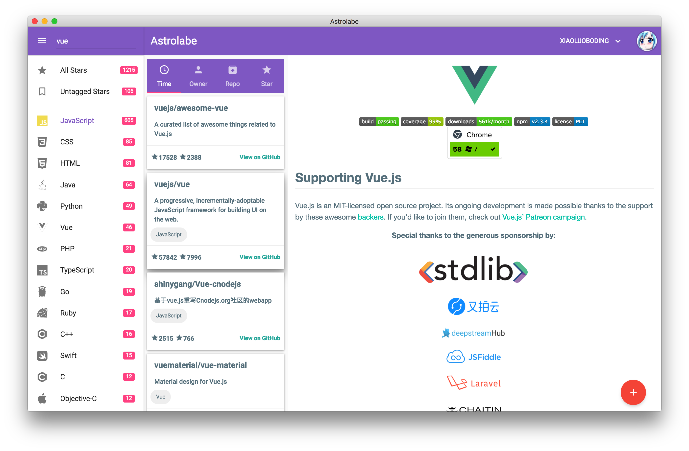

# Astrolabe

> Manage your GitHub Stars with One App

## Preview



## Tech Stack

* Electron 1.7.5
* Github Api 3.0+
* Lodash
* Material Design
* Muse-ui 3.0+
* Nedb
* Superagent
* Vue.js 2.5+
* Webpack 3.5.2

---

## Usage

``` bash
# install dependencies
npm install

# serve with hot reload at localhost:9080
npm run dev

# build electron app for production
npm run build

# lint all JS/Vue component files in `app/src`
npm run lint

# run webpack in production
npm run pack
```

## Features

- [x] Material Design UI
- [x] Github OAuth2 Login
- [x] Global search
- [x] Sort by recently starred、Owner name、Repository name、Most Stars
- [x] Categorized and navigated by language
- [x] Parse the preferred README for a repository
- [x] Highlight code
- [x] Copy clone link to clipboard
- [x] Download archive file
- [x] Back to top
- [x] Open All Link in Default Brower
- [x] Use `Nedb` for cache local data
- [x] Infinite scroll the description of repository
- [ ] Add tags & Manage tags
- [ ] User Card && Repo Card
- [ ] Setting Interface
- [ ] Icon design

# License

MIT
